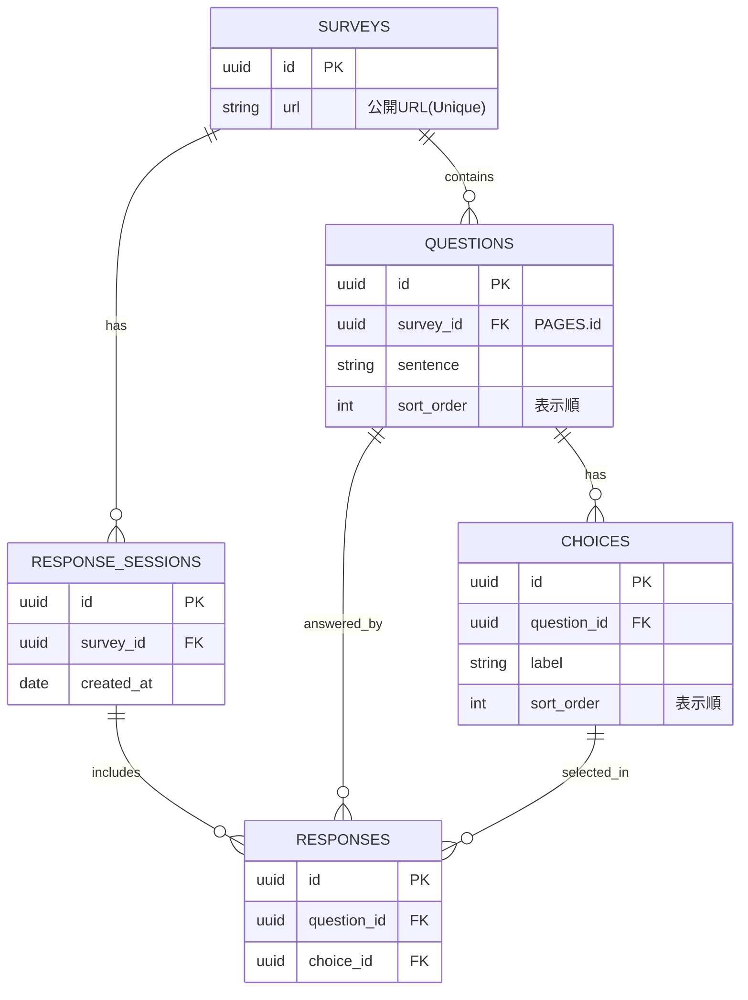

```mermaid
erDiagram
    SURVEYS { 
		uuid id PK 
		string url "公開URL(Unique)" 
		}

    QUESTIONS { 
uuid id PK 
uuid survey_id FK "PAGES.id" 
string sentence 
int sort_order "表示順" }

    CHOICES { 
uuid id PK 
uuid question_id FK 
string label 
int sort_order "表示順" }

    RESPONSES { 
uuid id PK 
uuid question_id FK 
uuid choice_id FK }

    RESPONSE_SESSIONS { 
uuid id PK
uuid survey_id FK
date created_at }


    
    SURVEYS     ||--o{ QUESTIONS          : contains
    QUESTIONS   ||--o{ CHOICES            : has
    SURVEYS     ||--o{ RESPONSE_SESSIONS : has
    RESPONSE_SESSIONS ||--o{ RESPONSES   : includes
    QUESTIONS   ||--o{ RESPONSES          : answered_by
    CHOICES     ||--o{ RESPONSES          : selected_in
```